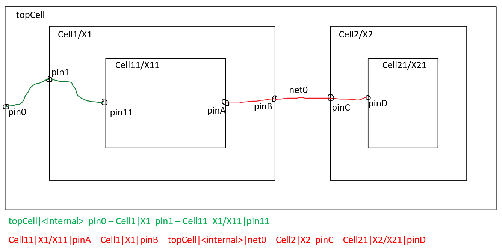

# netlist-tracer

[](https://github.com/parvez2083/netlist-tracer/actions/workflows/ci.yml)
[](LICENSE)
[](https://www.python.org/)
[](https://github.com/parvez2083/netlist-tracer/commits/main)

**Multi-format netlist parser and bidirectional hierarchical signal tracer**

Parse and analyze semiconductor netlists across CDL, SPICE, Spectre, SPF/DSPF, Verilog, SystemVerilog, and EDIF formats with automatic format detection. Trace signals bidirectionally through the design hierarchy, resolving aliases and identifying connectivity paths.

## Features

- **Multi-format auto-detection**: CDL, SPICE, Spectre, SPF/DSPF, Verilog, SystemVerilog, EDIF, Verilog-A
- **Bidirectional hierarchical tracing**: trace signals up and down the design tree with per-bit alias resolution
- **Parameter specialization**: expand parameterized instances with mangled cell variants; `defparam` resolution per Verilog LRM
- **Concat-form decomposition**: decompose multi-bit vectors into per-bit assignment paths
- **Supply-net safety**: detect and label power/ground connectivity
- **Constant-tie optimization**: resolve tied nets to constant values
- **JSON cache fast-path**: serialize parsed netlists for rapid re-use
- **Include-directive resolution**: follow `.include`, `.inc`, `.lib` (SPICE/CDL — including section-aware loading for `.lib path SECTION`), `include` and `simulator lang=spice` (Spectre, including section-aware `include "path" section=NAME"`, and `ahdl_include` for Verilog-A) across files, with cycle detection and configurable search paths via `-include`. Path resolution honors `~` and `$VAR` environment variable expansion. Best-effort `.lib` directives (with or without section names) emit a WARNING and continue on unresolvable paths or missing sections; `.include` and `.inc` remain strict and raise. Verilog-A `.va` files referenced by `ahdl_include` are merged transparently; malformed files emit WARNING and are skipped.
- **Flat-deck top synthesis**: when a netlist has no explicit top subcircuit (e.g. flat testbench decks), a synthetic top cell named `__<filename>__` is generated so deck-level instances can be traced.
- **Advanced SPICE/CDL support**: HSPICE inline comments (`;` and `$`), continuation lines merging across `*` comment lines, controlled-source elements (B/E/F/G/H) as instances with control source tracking, coupled inductors (K), `.global` directive parsing, and engineering-suffix-aware numeric parsing via `parse_numerical()` helper.
- **Verilog elaboration**: `generate-if` and `generate-case` block unrolling, built-in gate primitives (and/or/nand/nor/xor/xnor/buf/not) as instances, `defparam` override semantics.
- **Bus notation**: both `[N]` (Verilog) and `<N>` (Spectre/Cadence) conventions supported in `expand_pin` and bare-bus suggestions.
- **Performance harness**: regression test for 1000-instance designs marked `@pytest.mark.slow`, opt-in via `-m slow`.

## Install

```bash
pip install -e .
```

Note: PyPI publish is not yet available. Clone the repository and install from source.

## Quickstart

### Parse a netlist

```python
from netlist_tracer import NetlistParser

# Automatic format detection
parser = NetlistParser("design.v")  # or .sp, .cdl, .scs, .spf, .dspf, .edf, .edn

print(f"Format: {parser.format}")
print(f"Subcircuits: {len(parser.subckts)}")
print(f"Instances: {sum(len(v) for v in parser.instances_by_parent.values())}")
```

### Trace a signal

```python
from netlist_tracer import NetlistParser, BidirectionalTracer, format_path

parser = NetlistParser("inverter.spice")
tracer = BidirectionalTracer(parser)

# Trace from input pin A to all endpoints
paths = tracer.trace("inv_1", "A")

for path in paths:
    print(format_path(path))
```

### Understanding the trace output

Each trace path is rendered as a sequence of `cell|instance|pin` tokens separated by ` -- `. The diagram below maps two example traces onto a small hierarchy:



```
topCell|<internal>|pin0 -- Cell1|X1|pin1 -- Cell11|X1/X11|pin11
Cell11|X1/X11|pinA -- Cell1|X1|pinB -- topCell|<internal>|net0 -- Cell2|X2|pinC -- Cell21|X2/X21|pinD
```

Notation:
- `cell` — the cell type (definition) the step is inside
- `instance` — hierarchical instance path (e.g. `X1/X11` means instance `X11` inside instance `X1`); `<internal>` denotes the top-level scope (no enclosing instance)
- `pin` — the pin or net name at this step
- ` -- ` — boundary crossing between adjacent cells in the path

## CLI Reference

### `netlist-tracer` — hierarchical signal tracing

```
netlist-tracer -netlist <file|dir> -cell <cell> [-pin <pin>] [-target <cell>] [-max_depth <n>] [-trace_format <fmt>] [-defines <csv>] [-include <dir>]
```

| Option | Description |
|--------|-------------|
| `-netlist` | Path to netlist file or Verilog directory |
| `-format` | Explicit format specification: `spice`, `cdl`, `spectre`, `spf`, `verilog`, `edif`, or `auto` (default). Overrides auto-detection. |
| `-include` | Search path for unresolved include directives. Searched for `.include`, `.inc`, `.lib`, and Spectre `include` directives. Repeatable. |
| `-cell` | Starting cell or instance name |
| `-pin` | Pin name(s), BIT-LEVEL form (e.g. `data[3]`). Comma-separated or repeated flag. Omit to trace all bit-level pins of cell. |
| `-target` | Optional target cell (traces to all endpoints if omitted) |
| `-max_depth` | Limit path depth (useful for supply nets) |
| `-trace_format` | Output format: `text` (default) or `json` |
| `-defines` | Comma-separated preprocessor defines (Verilog/SV only) |

### `netlist-parser` — build and cache JSON

```
netlist-parser -netlist <file|dir> -output <file.json>
```

Serializes a parsed netlist to JSON for fast subsequent loading.

## Library API

### `NetlistParser(filename, tvars=None, defines=None, define_values=None, top=None, workers=0, format='auto')`

Parse a netlist from file, directory, or JSON cache.

**Parameters:**
- `format` — explicit format specification: `'spice'`, `'cdl'`, `'spectre'`, `'verilog'`, `'edif'`, or `'auto'` (default). Overrides auto-detection if a specific format is provided. Invalid values raise `NetlistParseError`.

**Attributes:**
- `format` — detected or specified format: `'spice'`, `'cdl'`, `'spectre'`, `'verilog'`, `'edif'`
- `subckts` — dict mapping cell names to `SubcktDef` objects
- `instances_by_parent`, `instances_by_celltype`, `instances_by_name` — lookup indices

### `BidirectionalTracer(parser)`

Trace signals bidirectionally through the hierarchy.

**Methods:**
- `trace(start_name, start_pin, target_name=None, max_depth=None)` — return list of `TraceStep` paths
- `trace_pins(start_name, pins=None, target_name=None, max_depth=None)` — trace multiple pins at once; returns dict mapping `pin_name -> [paths]`. If `pins=None`, traces all bit-level pins in the cell. Bare bus base names in `pins` (e.g. `'data'` when `data[0..N]` exist) auto-expand to all indexed members.
- `expand_pin(subckt, name)` — helper that returns `[name]` if `name` is an exact pin, all bit-level members if `name` is a bare bus base, or `[]` if unknown. Used internally by `trace_pins` for bus expansion.
- `resolve_name(name)` — resolve cell/instance name to `(cell_type, inst_chain)` tuples

### `TraceStep`

Represents one step in a signal path.

**Attributes:**
- `cell` — cell/module name
- `pin_or_net` — pin or net identifier
- `direction` — `'start'`, `'down'`, `'up'`, or `'alias'`
- `instance_name` — instance name (if applicable)
- `inst_stack` — tuple of `(inst_name, parent_cell)` pairs for hierarchy

### `format_path(path)`

Format a list of `TraceStep` objects into a human-readable string. Each step renders as `cell|instance|pin`, with steps joined by ` -- `:

```
topCell|<internal>|pin0 -- Cell1|X1|pin1 -- Cell11|X1/X11|pin11
```

`<internal>` denotes the top-level scope (no enclosing instance); nested instances appear as `parent/child` (e.g. `X1/X11`). See [Understanding the trace output](#understanding-the-trace-output) above for a visual walkthrough.

### `merge_aliases_into_subckt(sub, pairs)`

Merge `assign` alias pairs into a subcircuit definition using union-find, preserving port names as canonical roots.

## Pin tracing forms

`-pin` accepts three equivalent forms; each produces per-bit trace sections in the output:

| Form | Example | Effect |
|------|---------|--------|
| Single pin | `-pin clk` | Trace one pin |
| Comma-separated | `-pin clk,resetn,mem_addr[0]` | Trace each listed pin |
| Repeated flag | `-pin clk -pin resetn` | Same as comma-separated |
| Bare bus name | `-pin mem_addr` | Expand to all `mem_addr[0]..mem_addr[N]` bits as separate sections |
| Omitted | (no `-pin`) | Trace every bit-level pin in the cell |

Unknown pin names (typos, names that don't exist as a pin or as a bus base) error with `ERROR: Pin '...' not found in cell '...'` and exit non-zero. The error includes a `Did you mean: [...]` suggestion list.

## File Format Support

| Format | Notes |
|--------|-------|
| **Verilog/SystemVerilog** | Full elaboration with parameter specialization, generate-loop expansion, and alias resolution (`assign`). Multi-file support with header discovery. |
| **SPICE/CDL** | SUBCKT / ENDS blocks. Instance lines parsed with net and parameter extraction. CDL distinguished by `*.PININFO` markers. |
| **Spectre** | SUBCKT / ENDS (no dot prefix). Bracket-escaped special characters handled. |
| **EDIF** | EDIF 2.0.0 (`.edf`, `.edn`). Cells, ports (including bus arrays), instances, and nets parsed; the design's top cell is identified from the `(design ...)` block. |
| **JSON** | Fast-path cache format (output of `parser.dump_json()` or `netlist-parser` CLI). |

## Development

### Install dev dependencies

```bash
pip install -e '.[dev]'
```

### Run tests

```bash
pytest                    # all tests
pytest -m "not slow"      # skip regression tests
```

### Lint and format

```bash
ruff check .              # static checks
ruff format .             # auto-format
```

### Type checking

```bash
mypy src/
```

### Code style

- Functions and methods: `snake_case`
- Classes: `PascalCase`
- Public API: full type hints
- Internal helpers: type hints where helpful

### Adding new tests

- Synthetic fixtures: `tests/fixtures/synthetic/`
- Format-specific tests: `test_parser_<format>.py`
- Regression tests: `test_*_regression.py` (marked `@pytest.mark.slow`)

## License

MIT License — see [LICENSE](LICENSE) for details.

**Copyright © 2026 Parvez Ahmmed**
